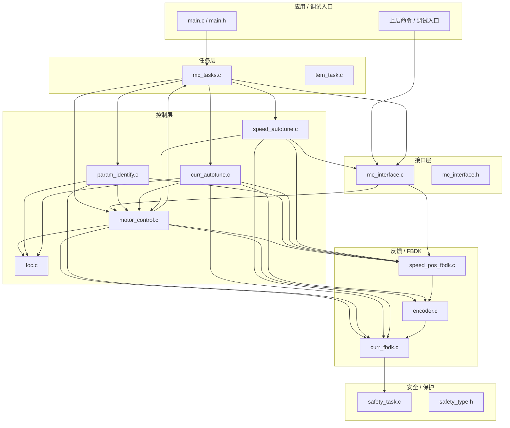

# 1. 模块关系图

下面是最新版 0512 的模块关系梳理。

## 读取方式

- `mc_tasks.c` 是状态调度中心，决定当前走空闲、校准、整定、运行或故障。
- `mc_interface.c` 是对外操作入口，负责启停、状态字、控制字和基础配置。
- `motor_control.c` 是主控制逻辑，负责 FOC、速度环、电流环和开环运行。
- `curr_autotune.c` 与 `speed_autotune.c` 是 SG 风格核心增量，负责参数识别和闭环整定。
- `encoder.c` 与 `speed_pos_fbdk.c` 提供位置和速度反馈基础能力。
- `curr_fbdk.c` 负责 PWM、电流采样和驱动输出，是硬件抽象底座。
- `safety_task.c` 是保护和故障处理的外围支撑。

## 关键路径

1. 初始化：`Motor_Control_Init()`
2. 调度：`High_Frequency_Task()`
3. 运行：`FOC_Control()` -> `Curr_Control()` -> `Set_Phase_Duty()`
4. 整定：`MC_Calib_StartChain()` / `MC_Calib_StartParam()`
5. 恢复：`MC_Stop_Motor()` / `MC_Reset_Control_State()`

